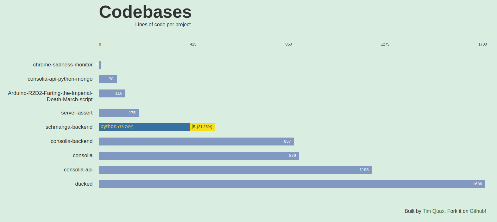

# Repomeister

A tool that calculates the meta data of GIT projects (the lines of code, breakdown of languages used) and generates an HTML report from it.

Dependencies:

- [sloccount](https://github.com/wisc/sloccount)
- [python](https://www.python.org/)
    - [jinja2](http://jinja.pocoo.org/docs/dev/)
    - [pymongo](https://api.mongodb.com/python/current/)

Sloccount turns out to be ancient, so i forked it and added support for languages that have arisen in the last decade plus. You can either [get and install the original sloccount](http://www.dwheeler.com/sloccount/) through apt or get the updated source [from here](https://github.com/wisc/sloccount) where i added support for Javascript, Go and PDE (arduino), and added a bunch of bugfixes, like the faulty loc counting for GIT repos.

## Getting started

1) Install dependencies:
```
$ sudo apt-get install sloccount
$ apt-get install python pip
$ pip install -r requirements.txt
```

2) The tool uses environment variables to inject environment-specific stuff. Just add these environment variables to your `~/.profile`:
```
export repomeister_db_host=127.0.0.1
export repomeister_db_port=27017
export repomeister_db_name=repomeister
```

3) Create a file called `repo_file` in the root and add your GIT repos to it. Just a list of GIT strings, like so:

./repo_file
```
git@github.com:wisc/consolia-api.git
git@bitbucket.org:timquax/consolia-api-python-mongo.git
git@bitbucket.org:timquax/consolia-backend.git
git@bitbucket.org:timquax/consolia.git
git@bitbucket.org:timquax/schmanga-backend.git
git@github.com:wisc/Arduino-R2D2-Farting-the-Imperial-Death-March-script.git
git@github.com:wisc/ducked.git
git@github.com:wisc/server-assert.git
git@github.com:wisc/chrome-sadness-monitor.git
```

4) Calculate meta data by running:

```
$ python update_repos.py
```

Which will clone all git repos in the list, get all info on them and store it in Mongo.

5) Compile the data to an HTML file:

```
$ python compile_web.py
```

Which will create `dist/index.html`, which is all you'll ever need. Yay.


## example screenshot


